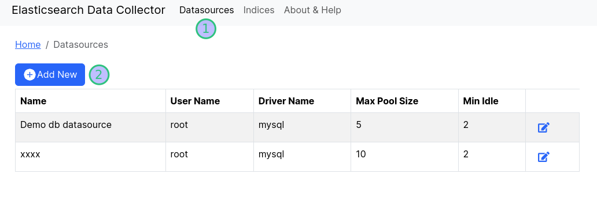
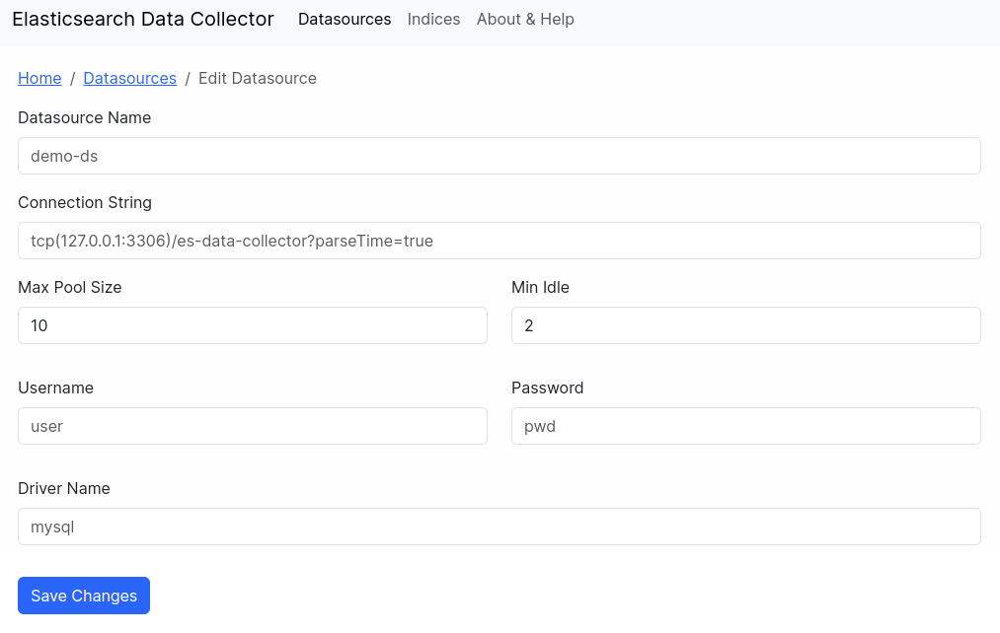
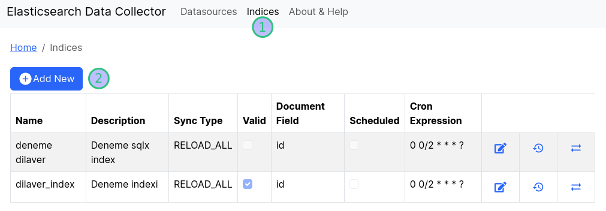
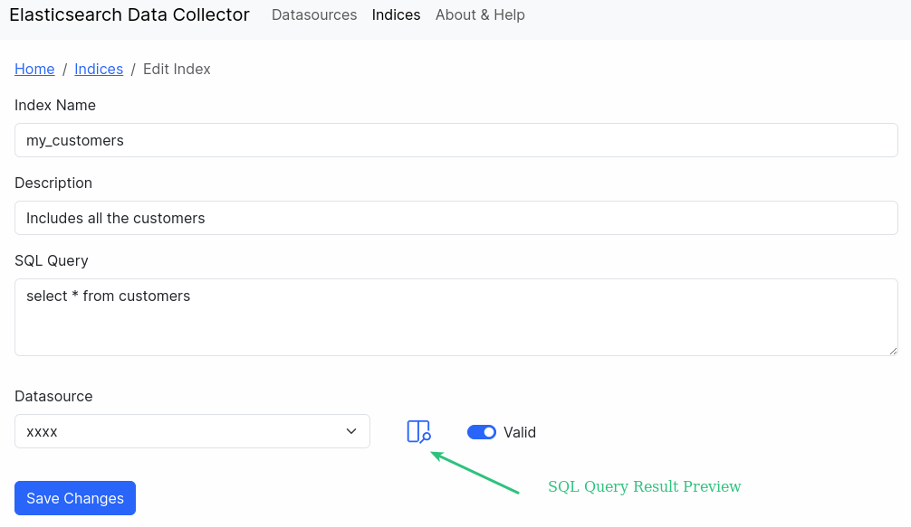
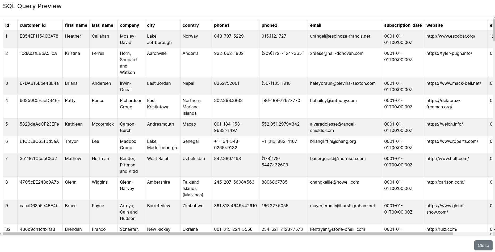
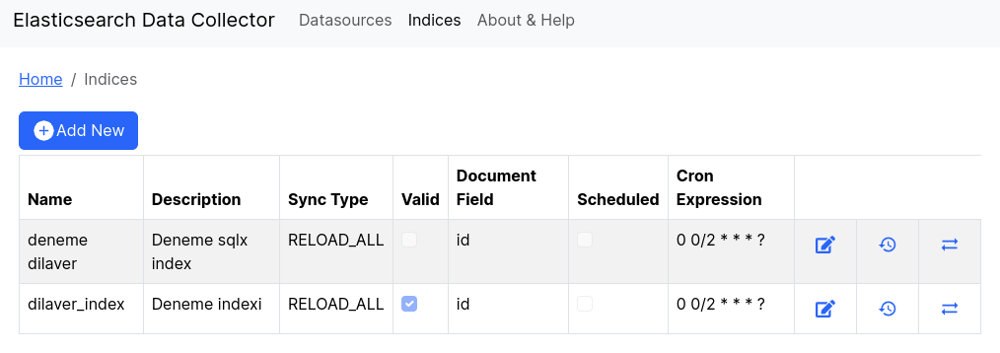
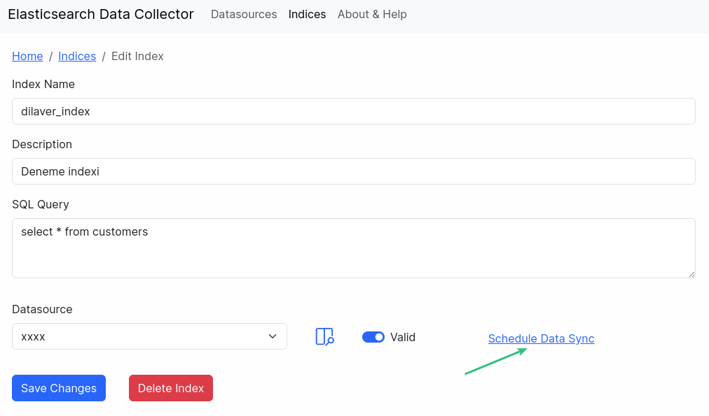
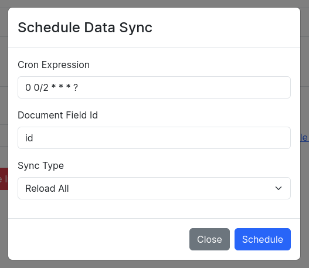

# Elasticsearch Data Collector

## What is the aim of this app?

Sometimes, you need to transfer your data that is on a RDBMS to Elasticsearch. **Elasticsearch Data Collector** can help you on that way. You can easily transfer your data to Elasticsearch with a few definitions and sql query.

### What do you need to do this?
- Create a datasource to retrieve your data
- Write a sql query and control the result of the query with the data preview feature
- Create a Elasticsearch index with the sql query
- Schedule a syncronization
that's it. 

After that your data will be on the Elasticsearch.

### Starting steps

#### Create a datasource

Go to the Datasources menu.

Click "Add New" button and fill the form with your database information and save.

You have done. Let's to the next step...

#### Create a Elasticsearch index

Let's we create a new index.

Click "Add New" button and fill the form with your information. You should enter a suitable name lowercase and concatenated with an underscore character. You can enter a description for your index. You must enter a valid sql query to retrieve your data from database. After that you must select your datasource. At this point you can preview your sql query results with clicking preview button.

If everyting is OK, save the index.

#### Schedule data synchronization

Go to the Indices menu and click the edit button on the list.

Click the "Schedule Data Sync" link.

Enter a valid cron expression what you want your synchronization period.

Enter the "Document Id Field". Document Id field must specify a unique row key in your data.

You must select a "Sync Type". There are the synchronization types: "Reload All" and "Iterative". If you select the **reload all** type, your exist data that is on the Elasticsearch will be deleted after synchronization. First, all the data in RDBMS will be transfered to Elasticsearch again. Don't worry. Until the synchronization is completed, your exist data will be reachable. When the synchronization is completed, you can reach the new data. And after that the old data that is on the Elasticsearch will be deleted.

If you select the **Iterative type**, you can only retrieve the data that is changed from after last synchronization time. To do that you can use the special keyword ":#sql_last_value" to modify your query dynamically. For example; "select * from customers where created_at >= :#sql_last_value".

